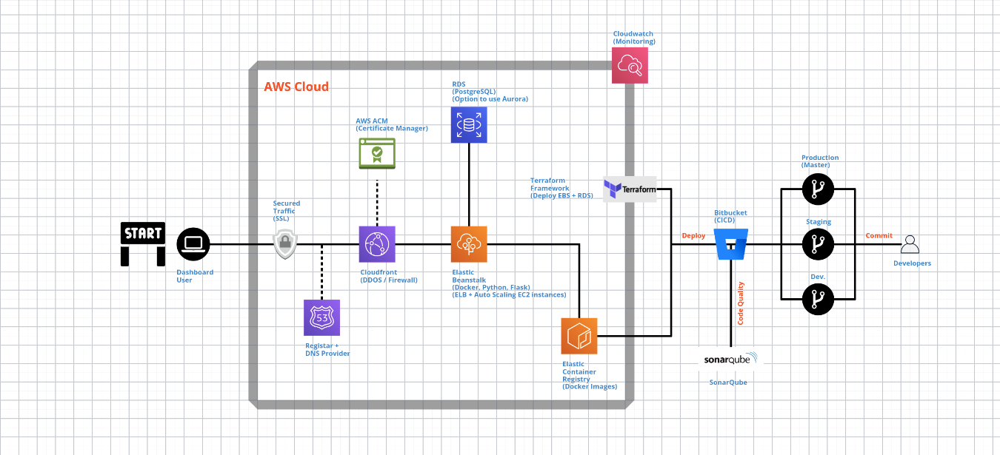

# AWS Architecture Overview

This document provides an overview of the architecture for the Farmcloud project deployed on Amazon Web Services (AWS).

## Table of Contents

- [Architecture Overview](#architecture-overview)
- [Components](#components)

- [Deployment](#deployment)
- [Monitoring and Logging](#monitoring-and-logging)

## Architecture Overview

Describe the high-level architecture of your project on AWS. Include key components, services, and their interactions. Provide a brief overview of how data flows through the system.

## Components

List and briefly describe the main components of your AWS architecture. Include services such as:

1. **Amazon EC2 (Elastic Compute Cloud):**
   - Virtual servers in the cloud.
   - Launch instances with varying compute capacity.

3. **Amazon ECS (Elastic Container Service):**
   - Manage Docker containers in a scalable and highly available environment.
   - Define and run containerized applications using ECS.

4. **Amazon ECR (Elastic Container Registry):**
   - Store, manage, and deploy Docker container images.
   - Securely host and scale your containerized applications.

5. **Amazon RDS (Relational Database Service):**
   - Fully managed relational database service.
   - Choose from various database engines (e.g., MySQL, PostgreSQL, SQL Server).

6. **Amazon S3 (Simple Storage Service):**
   - Object storage service to store and retrieve any amount of data.
   - Used for static assets, backups, or any binary data.

9. **Amazon EBS (Elastic Block Store):**
   - Persistent block storage for use with Amazon EC2 instances.
   - Provides scalable and high-performance storage volumes.

10. **Amazon Route 53:**
    - Scalable domain name system (DNS) web service.
    - Register and manage domain names and perform DNS routing.

11. **Amazon CloudFront:**
    - Global content delivery network (CDN) service.
    - Accelerates the delivery of your web content, including media files, images, and dynamic content.

12. **Etc.**
    - Include any other components relevant to your architecture.

Link of infrastructure :- [click here](https://app.cloudcraft.co/view/d4d238cf-c127-469a-9b2b-74fe91d59539?key=46cd515f-5034-4d3e-86a2-05a75888e1c1)

## Deployment
Explain how to deploy your application on AWS. Include deployment scripts, commands, or configuration files. Specify any considerations for different environments (e.g., development, staging, production).

## Monitoring and Logging
Monitoring Using AWS CloudWatch

